# Лабораторная работа №3: Наследование и иерархия классов — Voin и Mag (Вариант 6) 🎮⚔️

## Цель работы

- Освоить механизм **наследования классов**
- Научиться строить **иерархию объектов**
- Понять разницу между базовым и производным классами
- Научиться переиспользовать код через `super()`
- Освоить **переопределение методов** и **полиморфизм**


## Реализованная иерархия классов

В качестве базового класса используется **`Character`** из ЛР-1.  
Дочерние классы **`Voin`** и **`Mag`**.

### Класс `Voin` (Воин)

**Новые атрибуты:**
- `aura` — аура
- `motivazia` — мотивация

**Новые методы:**
- `kill_mag(target)` — убить мага
- `attack_mag(target)` — атаковать мага

**Переопределённые методы:**
- `make_sound()` — боевой клич воина
- `use_skill(target)` — использование способности

### Класс `Mag` (Маг)

**Новые атрибуты:**
- `mana` — мана
- `sleep` — сонливость

**Новые методы:**
- `kill_voin(target)` — убить воина
- `attack_voin(target)` — атаковать воина

**Переопределённые методы:**
- `make_sound()` — боевой клич мага
- `use_skill(target)` — использование способности

---

## Демонстрация работы

### Сценарий 1: Создание персонажей и вывод информации

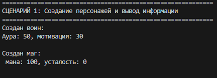

- Создание воина `Voin` с именем "Красавчик Ян", уровень 5, аура 50, мотивация 30
- Создание мага `Mag` с именем "Жуков Никита", уровень 5, мана 100
- Вывод информации через `__str__`

### Сценарий 2: Полиморфизм (make_sound)

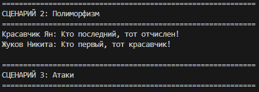

- Вызов `make_sound()` у воина: "Красавчик Ян: Кто последний, тот отчислен!"
- Вызов `make_sound()` у мага: "Жуков Никита: Кто первый, тот красавчик!"
- Один и тот же метод — разное поведение

### Сценарий 3: Атаки

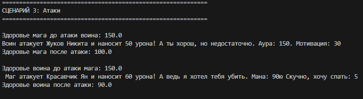

- Воин атакует мага методом `attack_mag()` — наносит урон, повышает ауру
- Маг атакует воина методом `attack_voin()` — тратит ману, наносит урон
- Отслеживание изменения здоровья

### Сценарий 4: Убийства

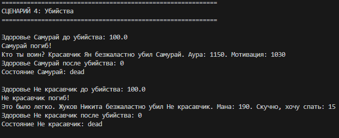

- Воин убивает мага методом `kill_mag()` — наносит 9999 урона, повышает ауру и мотивацию
- Маг убивает воина методом `kill_voin()` — наносит 9999 урона, повышает ману и сонливость
- Персонаж после убийства переходит в состояние `dead`

### Сценарий 5: Полиморфизм use_skill и проверка типов

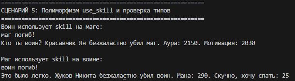

- Вызов полиморфного метода `use_skill(target)` у воина и мага
- Проверка типов через `isinstance()`: воин является `Voin` и `Character`, но не `Mag`; маг является `Mag` и `Character`, но не `Voin`


# Лабораторная работа №2: Коллекция объектов — CharacterTeam (Вариант 6) 🎮⚔️

## Цель работы

- Научиться работать с **коллекциями объектов**
- Понять разницу между **моделью сущности** и **контейнером объектов**
- Реализовать **собственный контейнерный класс**
- Освоить **итерацию по объектам** (`__iter__`, `__len__`, `__getitem__`)
- Реализовать базовые операции управления коллекцией (добавление, удаление, поиск, сортировка, фильтрация)

---

## Реализованная коллекция

В качестве элементов коллекции используется класс **`Character`** из ЛР-1 (игровой персонаж).  
Контейнерный класс **`CharacterTeam`** управляет группой персонажей.

### Класс `CharacterTeam` (коллекция)

**Атрибуты:**
- `_items` — внутренний список объектов `Character`.

## Демонстрация работы

### Сценарий 1: Создание коллекции, добавление, удаление, вывод

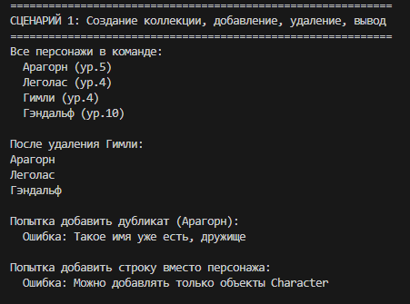

- Создаются персонажи `Арагорн`, `Леголас`, `Гимли`, `Гэндальф`.
- Добавление в коллекцию `CharacterTeam`.
- Проверка вывода всех элементов.
- Удаление одного персонажа (`Гимли`).
- Попытка добавить дубликат (по имени) — генерируется `ValueError`.
- Попытка добавить объект неправильного типа — `TypeError`.

### Сценарий 2: Поиск, длина, итерация

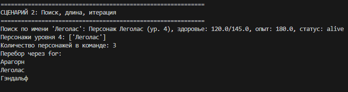

- Поиск по имени `find_by_name("Леголас")` возвращает объект.
- Поиск по уровню `find_by_level(4)` возвращает список персонажей уровня 4.
- `len(team)` — количество элементов.
- Цикл `for c in team:` — перебор всех персонажей.

### Сценарий 3: Индексация и удаление по индексу

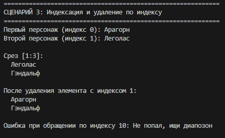

- Доступ по индексу: `team[0]` — первый персонаж, `team[1]` — второй.
- Срезы: `team[1:3]` возвращает подсписок.
- Удаление по индексу: `remove_at(1)` удаляет элемент с индексом 1.
- Обработка выхода за границы (`IndexError`).

### Сценарий 4: Сортировка

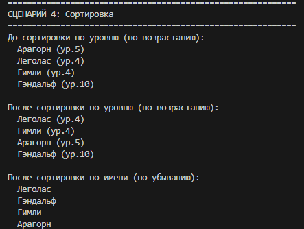

- `sort_by_level()` — сортировка по уровню (по возрастанию).
- `sort_by_name(reverse=True)` — сортировка по имени (по убыванию).
- Универсальная сортировка: `team.sort(key=lambda c: c.health)`.

### Сценарий 5: Фильтрация (логические операции)

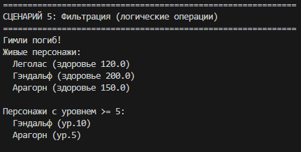

- `get_alive()` — возвращает **новую коллекцию** только с живыми персонажами.
- `get_by_min_level(5)` — возвращает коллекцию персонажей с уровнем ≥ 5.
- Фильтрация не изменяет исходную коллекцию.


# Лабораторная работа №1: Игровая логика — класс Character (Вариант 6) 🎮⚔️


## Цель работы

- Освоить объявление пользовательских классов
- Разобраться с инкапсуляцией (закрытые поля)
- Реализовать свойства (`@property`)
- Переопределить магические методы (`__str__`, `__repr__`, `__eq__`)
- Понять разницу между атрибутами класса и экземпляра

**Задумка**  
Создать игрового персонажа (Character), который:

- Следит за корректностью данных (валидация имени, уровня, здоровья, опыта)
- Запрещает недопустимые операции (лечение мёртвого, повышение уровня выше максимума)
- Предоставляет удобный интерфейс через свойства (`@property`)
- Имеет состояние (`alive`/`dead`), влияющее на доступные действия

---

## Реализованный класс

**Character**

```python
class Character:
    
    MAX_LEVEL = 100
    BASE_HEALTH = 100
    HEALTH_PER_LEVEL = 15
```

## Атрибуты класса:
MAX_LEVEL — максимально достижимый уровень

BASE_HEALTH — базовое здоровье на 1 уровне

HEALTH_PER_LEVEL — прирост здоровья за уровень

## Закрытые поля:+_name — имя персонажа
+ _level — уровень
+ _health — текущее здоровье
+ _experience — опыт
+ _state — состояние (alive/dead)

## Свойства @property:
+ name (чтение) — имя персонажа
+ name (чтение и запись) — сеттер с валидацией
+ level (чтение) — уровень
+ health (чтение) — текущее здоровье
+ experience (чтение) — опыт

+ state (чтение) — состояние

+ max_health (вычисляемое, чтение) — максимальное здоровье в зависимости от уровня

## Магические методы:
+ str — для print (читаемое описание)

+ repr — для разработчиков

+ eq — сравнение по имени и уровню

## Бизнес-методы:
+ take_damage(amount) — получение урона

+ heal(amount) — лечение

+ gain_experience(amount) — получение опыта
  
+ level_up() — повышение уровня

attack(target) — атака другого персонажаив ли персонаж (если нет — выбрасывают RuntimeError). Также проверяются корректность входных данных (тип, диапазон).git 

### Сценарий 1: Создание персонажей

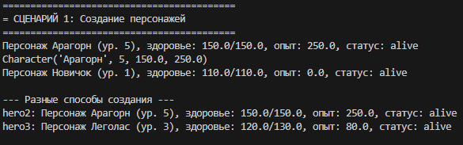

+ Создание персонажа с полными параметрами (Арагорн, уровень 5, здоровье 150, опыт 250)
+ Создание персонажа с параметрами по умолчанию (Новичок)
+ Создание нескольких персонажей с разными характеристиками

Показывает, что каждый персонаж получает свои уникальные характеристики, а значения по умолчанию применяются корректно.
  
### Сценарий 2: Валидация (обработка ошибок)

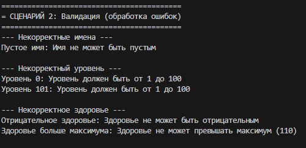

+ Некорректные имена (пустые)
+ Некорректный уровень (0, 101 — превышение MAX_LEVEL)
+ Некорректное здоровье (отрицательное, больше максимума)

Программа намеренно пытается создать персонажей с некорректными данными, чтобы продемонстрировать защиту от ошибок.

### Сценарий 3: Свойства (геттеры/сеттеры)

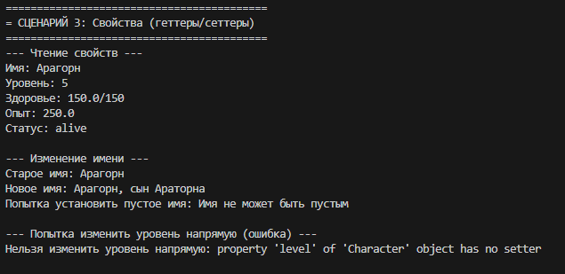

+ Чтение всех свойств (имя, уровень, здоровье, опыт, статус)
+ Изменение имени владельца
+ Попытка изменения уровня напрямую (ошибка — уровень меняется только через методы)

Демонстрируется, как работать со свойствами класса — читать данные через геттеры и изменять через сеттеры с валидацией.

### Сценарий 4: Атрибуты класса

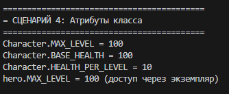

+ Доступ к атрибутам класса через сам класс (Character.MAX_LEVEL)
+ Доступ к атрибутам класса через экземпляр (hero.MAX_LEVEL)

Показывается разница между атрибутами класса (общие для всех) и атрибутами экземпляра (индивидуальные).

### Сценарий 5: Боевые механики

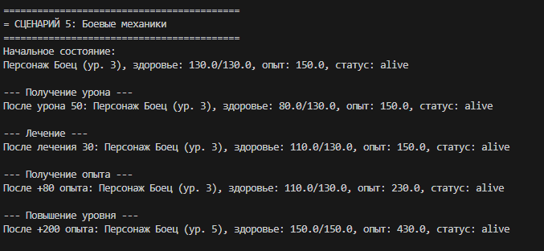

+ Получение урона (здоровье уменьшается)
+ Лечение (здоровье восстанавливается, но не выше максимума)
+ Получение опыта
+ Повышение уровня при накоплении достаточного опыта

Демонстрируются основные RPG-механики и проверка граничных значений.

### Сценарий 6: Смерть и ограничения

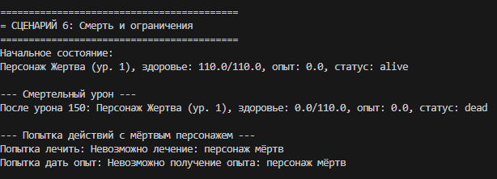

+ Смертельный урон (здоровье становится 0, статус меняется на "dead")
+ Попытка лечить мёртвого персонажа (ошибка)
+ Попытка дать опыт мёртвому персонажу (ошибка)

Прослеживается жизненный цикл персонажа — смерть блокирует все дальнейшие действия.

### Сценарий 7: Атака между персонажами

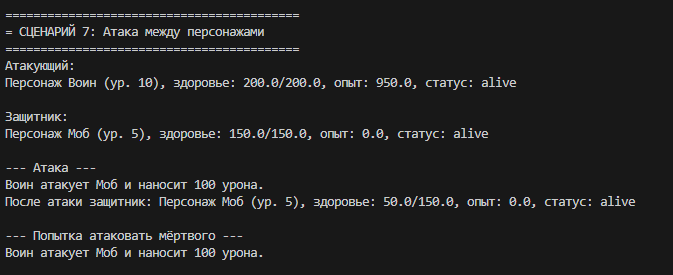

+ Атака одного персонажа другим (урон = уровень × 10)
+ Смерть защитника от полученного урона
+ Попытка атаковать уже мёртвого персонажа (ошибка)

Демонстрируется взаимодействие двух объектов — передача урона и изменение состояния.

### Сценарий 8: Повышение уровня и максимальный уровень

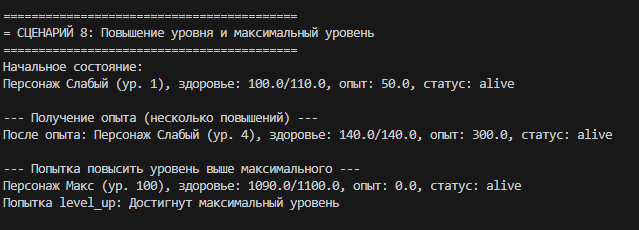

+ Получение опыта, приводящее к нескольким повышениям уровня подряд
+ Попытка повысить уровень выше максимального (ошибка)

Показывается, что уровень не может превысить атрибут класса MAX_LEVEL.

### Сценарий 9: Магические методы

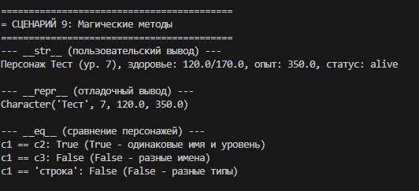

str (пользовательский вывод):
+ Создаётся персонаж
+ Выводится результат print(character)
+ На экране появляется читаемое описание персонажа
+ Это метод, который вызывается, когда объект нужно показать пользователю

repr (отладочный вывод):
+ Выводится результат repr(character)
+ Появляется строка типа Character('Арагорн', 5, 150.0, 250.0)
+ Это представление для отладки, показывающее, как создать такой же объект

eq (сравнение персонажей):
+ Сравниваем двух персонажей с одинаковыми именем и уровнем — True
+ Сравниваем с персонажем с другим именем — False
+ Сравниваем с объектом другого типа — False

Показать, что наши объекты можно выводить и сравнивать как встроенные типы Python.

### Сценарий 10: Проверка некорректных операций

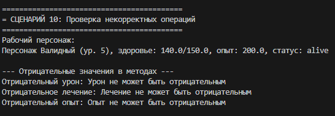

+ Попытка нанести отрицательный урон (ошибка)
+ Попытка вылечить на отрицательную величину (ошибка)
+ Попытка дать отрицательный опыт (ошибка)

Демонстрируется, что все методы проверяют корректность входных данных и при ошибках персонаж остаётся в целостном состоянии.

